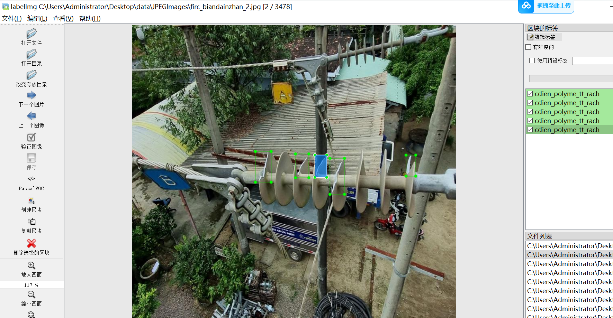
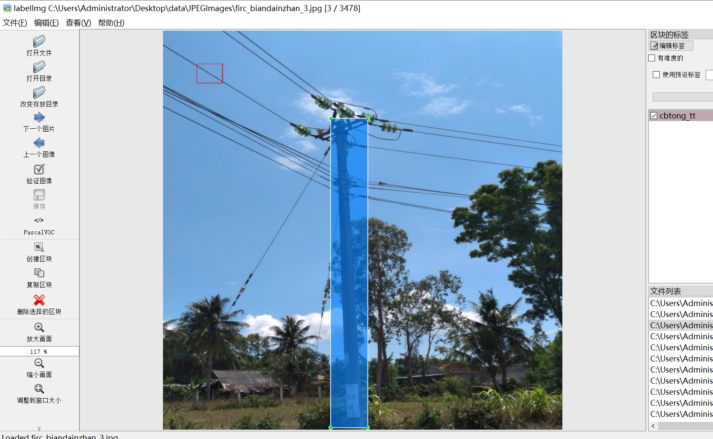
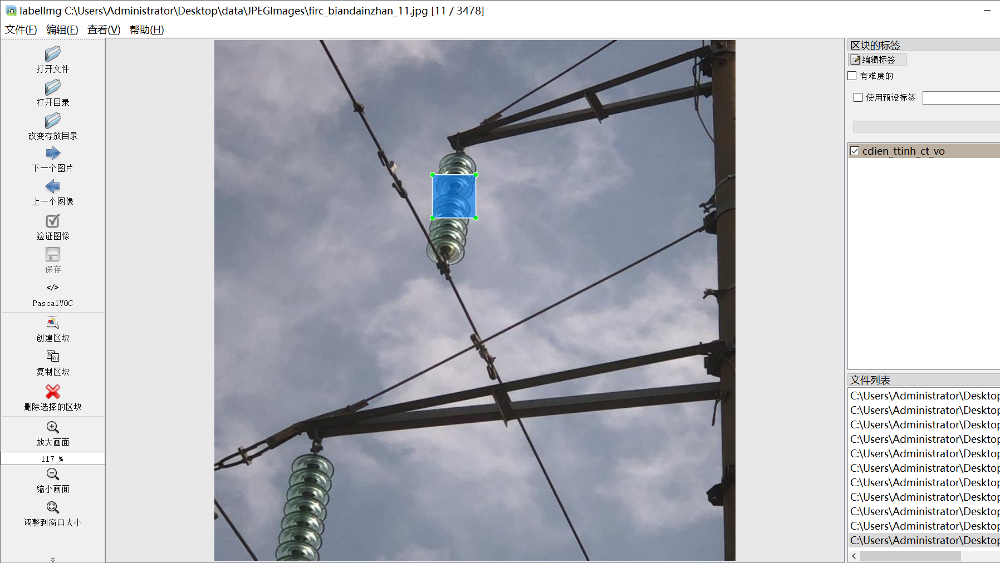
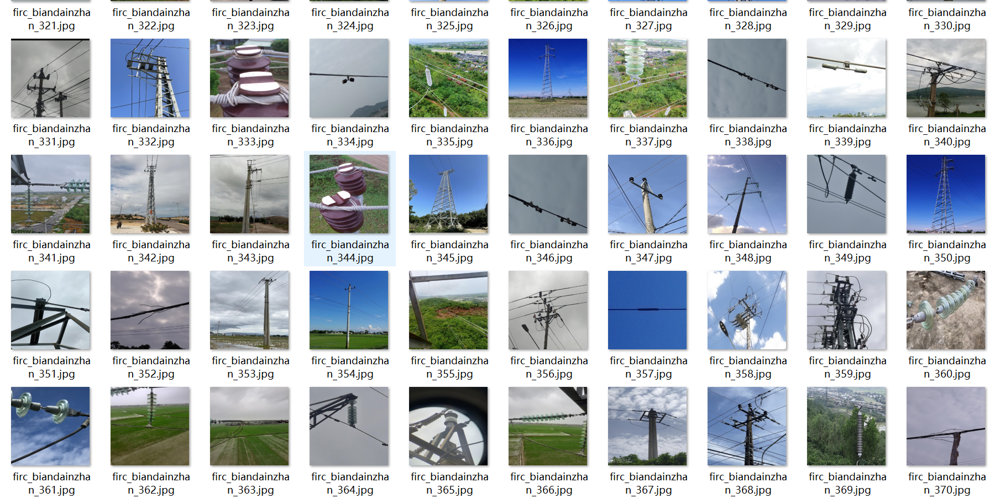
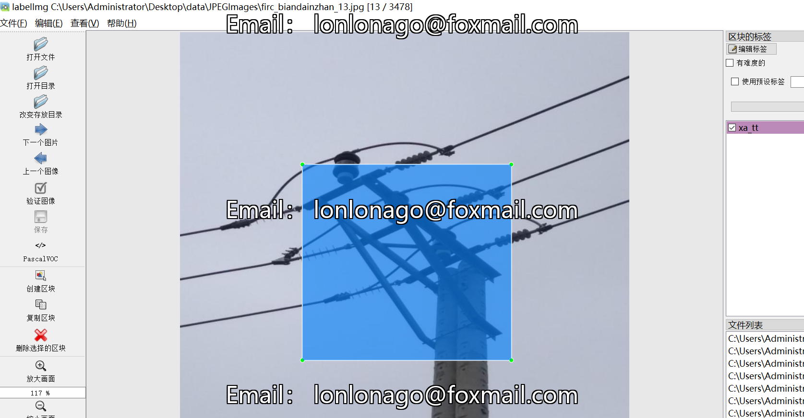
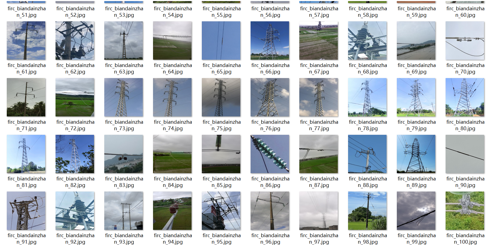

# Transmission Line Road Inspection Detection Dataset VOC+YOLO format3830 images44-class

Dataset format: Pascal VOC format + YOLO format (the txt file does not contain the split path, it only contains jpg images and corresponding VOC format xml files and yolo format txt files)

Number of images (number of jpg files): 3830

Number of annotations (number of xml files): 3830

Number of annotations (number of txt files): 3830

Number of annotation classes: 44

Annotation class names: ["cbtongct","cbtongtt","cdien_gom_ban","cdien_gom_tt_nut","cdien_gom_tt_vo","cdien_polyme_ct_ban","cdien_polyme_ct_rach","cdien_polyme_tt_ban","cdien_polyme_tt_rach","cdien_ttinh_ct_ban","cdien_ttinh_ct_vo","cdien_ttinh_tt_ban","cdien_ttinh_tt_vo","csat_ct","csat_tt","csv_ct","csv_dz_tt","dbcsu_tt","dcl_tt","dcleo_ct","dcset_ct","ddan_boc_tt","ddan_ct","ddan_ct_tua","ddan_ct_vatla","ddan_tran_tt","ddan_tt_mon","ddan_tt_tua","ddan_tt_vatla","fco_tt","kdo_ct","kdo_tt","kdre_tt","kneo_ct","kneo_tt","krang_tt","lbs_tt","leo_ct","mnoi_ct","mnoi_tt","rec_tt","tcrung_ct","vday_tt","xa_tt"]

Number of boxes labeled in each category:

cbtong_ct frame count = 108

cbtong_tt frame count = 158

cdien_gom_ban frame count = 191

cdien_gom_tt_nut frame count = 58

cdien_gom_tt_vo frame count = 64

cdien_polyme_ct_ban frame count = 219

cdien_polyme_ct_rach frame count = 106

cdien_polyme_tt_ban frame count = 119

cdien_polyme_tt_rach frame count = 136

cdien_ttinh_ct_ban frame count = 172

cdien_ttinh_ct_vo frame count = 65

cdien_ttinh_tt_ban frame count = 78

cdien_ttinh_tt_vo frame count = 65

csat_ct frame count = 142

csat_tt frame count = 109

csv_ct frame count = 85

csv_dz_tt frame count = 261

dbcsu_tt frame count = 329

dcl_tt frame count = 89

dcleo_ct frame count = 120

dcset_ct frame count = 63

ddan_boc_tt frame count = 143

ddan_ct frame count = 447

ddan_ct_tua frame count = 51

ddan_ct_vatla frame count = 60

ddan_tran_tt frame count = 177

ddan_tt_mon frame count = 63

ddan_tt_tua frame count = 60

ddan_tt_vatla frame count = 77

fco_tt frame count = 254

kdo_ct frame count = 109

kdo_tt frame count = 113

kdre_tt frame count = 113

kneo_ct frame count = 192

kneo_tt frame count = 434

krang_tt frame count = 125

lbs_tt frame count = 50

leo_ct frame count = 144

mnoi_ct frame count = 52

mnoi_tt frame count = 148

rec_tt frame count = 57

tcrung_ct frame count = 184

vday_tt frame count = 93

xa_tt frame count = 386

Total boxes: 6269

Use the labeling tool: labelImg

Rules for annotation: Draw a rectangle around the category.

Important Note: None

Special Notice: This dataset does not guarantee the accuracy or precision of the trained models or weight files. The dataset only provides accurate and reasonable annotations.

Label Comparison:

CB Tong _ CT = Total carrying body (Porcelain jar) body

CB tong TT=Total Carry Body (Porcelain Jar) head

CDien_gom_ban=Ceramic insulator soiling

cdien_gom_tt_nut=Ceramic Insulator headPart Crack

cdien_gom_tt_vo=Ceramic Insulator headPart Damage

"Cdien_polyme_ct_ban=Polymer Insulator Body Fouling"

cdien_polyme_ct_rach=gather combine object Insulator copy body Crack

CDien_polyme_tt_ban=Polymer insulator head dirt

cdien_polymer_tt_rach=gather combine object Insulator head Part Crack

CDien_ttinh_ct_ban=composite insulator body soil

cdien_ttinh_ct_vo=composite insulator copy body Damage

CDien_Ttinh_TT_Ban=composite insulator head dirt

cdien_ttinh_tt_vo=composite insulator headPart Damage

csat_ct=Steel Tower copy body

csat_tt=Steel Tower roofPart

csv_ct=Transmission Line copy body

CSV_DZ_TT = Terminal head of conductor

dbcsu_tt=Cable protect protect set head Part

dcl_tt=ground wire head Part

dcleo_ct=ground wire copy body

dcset_ct=supporting body

ddan_boc_tt=Cable protect set head Part

ddan_ct=Cable copy body

ddan_ct_tua=Cable copy body distortion

ddan_ct_vatla=Cable copy body Foreign Object

ddan_tran_tt=Cable connect join head Part

ddan_tt_mon=Cable headPart corrosion

ddan_tt_tua=Cable headPart distortion

ddan_tt_vatla=Cable headPart Foreign Object

fco_tt=fuse head

kdo_ct=Switch copy body

kdo_tt=Switch headPart

kdre_tt is a type of circuit breaker head.

Kneo_CT = Anchoring Device Body

Anchoring device head

【Translated Text】Krang-tt=Climbing Distance Device Head

Lbs_tt = Load Break Switch Head

leo_ct=ground wire join ground load place copy body

mnoi_ct=join ground load place copy body

mnoi_tt=join ground load place head Part

Rec_tt = Complex Switch Head

tcrung_ct=intersection body

vday_tt=guide wire head Part

Xa_tt=contact head of switch

## Images

---

Here is a pay link on Stripe (https://buy.stripe.com/3cs8yP7sY87d0vu9AB). Please contact me lonlonago@foxmail.com after funding $89, and I will send you a complete data files, thank you!

